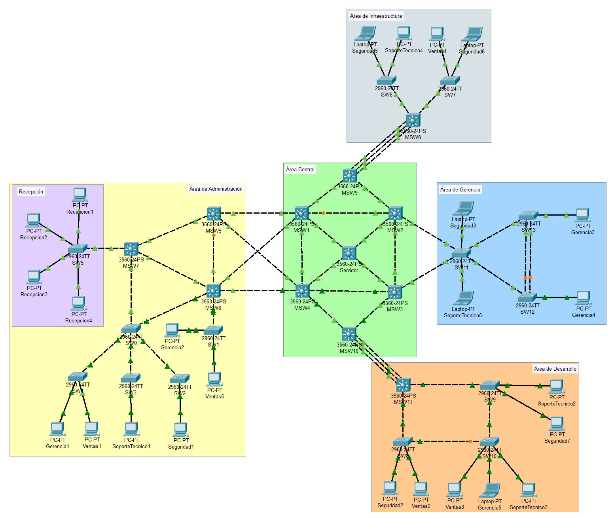
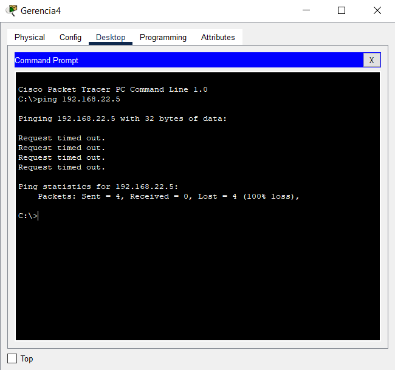
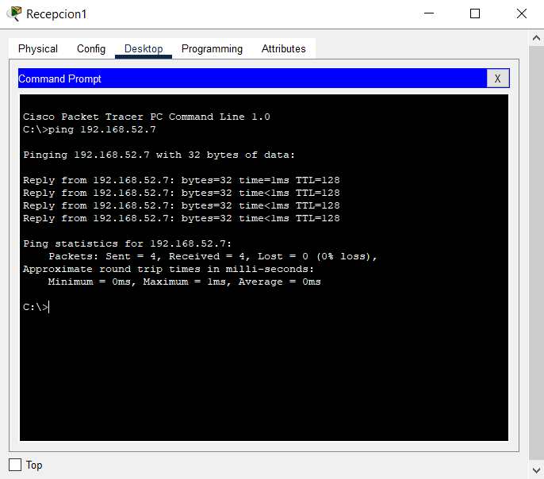
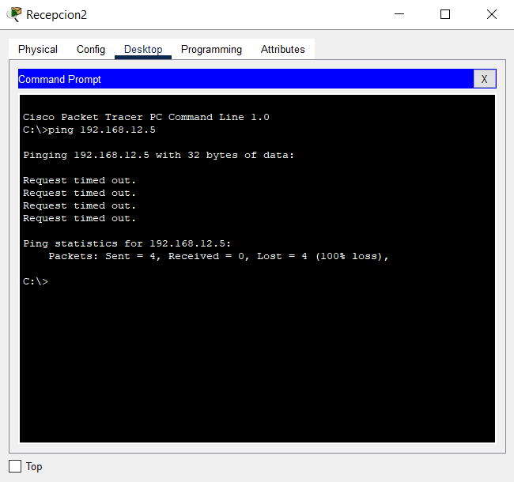
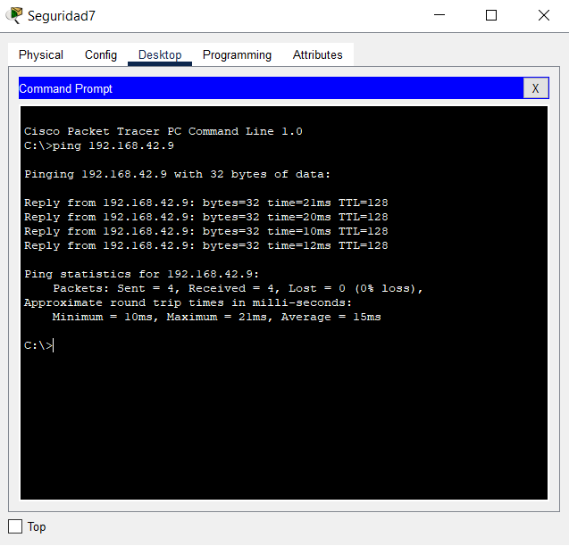

# MANUAL TÉCNICO - PROYECTO 1
#### Laboratorio de Redes de Computadoras 1 - Sección A
---------
El proyecto 1 del laboratorio de Redes de Computadoras 1 consiste en diseñar, configurar e implementar una topología de red para la empresa "Tech Solutions S.A.", la cual requiere de una red optimizada que permita la comunicación eficiente entre sus departamentos. Debido a que se cuenta con un presupuesto limitado, la infraestructura de red utilizará un mismo medio físico para conectar las áreas y se segmentará lógicamente a través de VLANs. Los departamentos que estarán conectados a la red serán los siguientes:

* Área Central (Backbone)
* Área de Administración
* Área de Desarrollo
* Área de Infraestructura
* Área de Gerencia

Los dispositivos de cada área se configurarán adecuadamente, proporcionándoles una dirección IP única de acuerdo a la vlan a la que pertenecen. Asimismo, se configurará el protocolo Spanning Tree (en modo rapid-PVST) para evitar bucles dentro de la red; y se implementará EtherChannel para aumentar el ancho de banda, mejorar la redundancia y balancear la carga de los departamentos de Infraestructura (PAgP) y Desarrollo (LACP).

Al finalizar las configuraciones, se realizarán pruebas de conectividad, asegurando que los equipos pertenecientes a una misma vlan puedan comunicarse únicamente entre sí, y también se elaborará un presupuesto estimado que tome en cuenta los costos de los diferentes dispositivos de red y cableado necesario para llevar a cabo la implementación de la topología.

## Tabla de direcciones IP y VLAN

En la siguiente tabla se presentan los distintos equipos presentes en la empresa, especificando su ID, tipo, la IP que utilizan, la VLAN a la que tienen acceso y el departamento en el cual se ubican.

| ID EQUIPO       | TIPO    | IP            | VLAN | DEPARTAMENTO          |
| :-------------: | :-----: | :-----------: | :--: | :-------------------: |
| Ventas1         | Desktop | 192.168.12.5  | 12 | Área de Administración  |
| Ventas2         | Desktop | 192.168.12.6  | 12 | Área de Desarrollo      |
| Ventas3         | Desktop | 192.168.12.7  | 12 | Área de Desarrollo      |
| Ventas4         | Desktop | 192.168.12.8  | 12 | Área de Infraestructura |
| Ventas5         | Desktop | 192.168.12.9  | 12 | Área de Administración  |
| SoporteTecnico1 | Desktop | 192.168.22.5  | 22 | Área de Administración  |
| SoporteTecnico2 | Desktop | 192.168.22.6  | 22 | Área de Desarrollo      |
| SoporteTecnico3 | Desktop | 192.168.22.7  | 22 | Área de Desarrollo      |
| SoporteTecnico4 | Desktop | 192.168.22.8  | 22 | Área de Infraestructura |
| SoporteTecnico5 | Laptop  | 192.168.22.9  | 22 | Área de Gerencia        |
| Gerencia1       | Desktop | 192.168.32.5  | 32 | Área de Administración  |
| Gerencia2       | Desktop | 192.168.32.6  | 32 | Área de Administración  |
| Gerencia3       | Desktop | 192.168.32.7  | 32 | Área de Gerencia        |
| Gerencia4       | Desktop | 192.168.32.8  | 32 | Área de Gerencia        |
| Gerencia5       | Laptop  | 192.168.32.9  | 32 | Área de Desarrollo      |
| Seguridad1      | Desktop | 192.168.42.5  | 42 | Área de Administración  |
| Seguridad2      | Desktop | 192.168.42.6  | 42 | Área de Desarrollo      |
| Seguridad3      | Laptop  | 192.168.42.7  | 42 | Área de Gerencia        |
| Seguridad5      | Laptop  | 192.168.42.9  | 42 | Área de Infraestructura |
| Seguridad6      | Laptop  | 192.168.42.10 | 42 | Área de Infraestructura |
| Seguridad7      | Desktop | 192.168.42.11 | 42 | Área de Desarrollo      |
| Recepcion1      | Desktop | 192.168.52.5  | 52 | Recepción               |
| Recepcion2      | Desktop | 192.168.52.6  | 52 | Recepción               |
| Recepcion3      | Desktop | 192.168.52.7  | 52 | Recepción               |
| Recepcion4      | Desktop | 192.168.52.8  | 52 | Recepción               |

## Implementación topología

En la siguiente imagen se presenta la topología de red a implementar en la empresa, en donde se identifican las distintas áreas o departamentos de la organización y los equipos utilizados.



## Comandos utilizados

Para la configuración de los switches, se utilizaron los siguientes comandos:

##### CONFIGURACIÓN DE HOSTNAME
###### TODOS LOS SWITCHES
```
enable
configure terminal
hostname [nombre_host]
write memory
exit
```

##### CONFIGURACIÓN VTP Y VLANs
###### SWITCH SERVIDOR
```
enable
configure terminal
vtp mode server
vtp domain G5_technet
vtp password secure2025
vtp version 2
vlan 12
name VENTAS
exit
vlan 22
name SOPORTE
exit
vlan 32
name GERENCIA
exit
vlan 42
name SEGURIDAD
exit
// Configuración de puerto en modo trunk
interface FastEthernet0/X //Donde X es el número de interfaz
switchport trunk encapsulation dot1q
switchport mode trunk
exit
...
# Configuración de otros puertos en modo trunk
...
exit
write memory
exit
```

###### SWITCH TRANSPARENTE (SW5)
```
enable
configure terminal
vtp mode transparent
vtp domain G5_technet
vtp password secure2025
vtp version 2
vlan 52
name RECEPCION
exit
// Configuración de puerto en modo trunk
interface FastEthernet0/X //Donde X es el número de interfaz
switchport mode trunk
exit
// Configuración de puerto en modo acceso
interface FastEthernet0/X //Donde X es el número de interfaz
switchport mode access
switchport access vlan 52
exit
...
# Configuración de otros puertos en modo acceso
...
exit
write memory
exit
```

###### SWITCHES CLIENTES (MSW1, MSW2, MSW3, MSW4, MSW5, MSW6, MSW7, MSW8, MSW9, MSW10, MSW11)
```
enable
configure terminal
vtp mode client
vtp domain G5_technet
vtp password secure2025
vtp version 2
// Configuración de puerto en modo trunk
interface FastEthernet0/X //Donde X es el número de interfaz
switchport trunk encapsulation dot1q
switchport mode trunk
exit
...
# Configuración de otros puertos en modo trunk
...
exit
write memory
exit
```

###### SWITCHES CLIENTES (SW0, SW1, SW2, SW3, SW4, SW6, SW7, SW8, SW9, SW10, SW11, SW12, SW13)
```
enable
configure terminal
vtp mode client
vtp domain G5_technet
vtp password secure2025
vtp version 2
// Configuración de puerto en modo trunk
interface FastEthernet0/X //Donde X es el número de interfaz
switchport mode trunk
exit
...
# Configuración de otros puertos en modo trunk
...
[# PARA ALGUNOS SWITCHES #
// Configuración de puerto en modo acceso
interface FastEthernet0/X //Donde X es el número de interfaz
switchport mode access
switchport access vlan XX //Donde XX es el número de vlan a la que se dá acceso
exit
...
# Configuración de otros puertos en modo acceso
...
]
exit
write memory
exit
```

##### CONFIGURACIÓN STP (RSTP-rapid pvst)
###### TODOS LOS SWITCHES
```
enable
configure terminal
spanning-tree mode rapid-pvst
do w
exit
exit
```

###### SWITCH ROOT BRIDGE (SERVIDOR)
```
enable
configure terminal
spanning-tree vlan 12 root primary
spanning-tree vlan 22 root primary
spanning-tree vlan 32 root primary
spanning-tree vlan 42 root primary
do w
exit
exit
```

##### CONFIGURACIÓN ETHERCHANNEL (LACP)
###### SWITCHES MSW10 Y MSW11 (active-active)
```
enable
configure terminal
interface range FastEthernet 0/5-7
switchport trunk encapsulation dot1q
switchport mode trunk
switchport trunk allowed vlan all
channel-protocol lacp
channel-group 1 mode active
do w
exit
interface port-channel 1
switchport trunk encapsulation dot1q
switchport mode trunk
switchport trunk allowed vlan all
do w
exit
```

##### CONFIGURACIÓN ETHERCHANNEL (PAGP)
###### SWITCH MSW9 (desirable)
```
enable
configure terminal
interface range fastEthernet 0/5-7
switchport trunk encapsulation dot1q
switchport mode trunk
switchport trunk allowed vlan all
channel-protocol pagp
channel-group 1 mode desirable
do w
exit
interface port-channel 1
switchport trunk encapsulation dot1q
switchport mode trunk
switchport trunk allowed vlan all
do w
exit
```

###### SWITCH MSW8 (auto)
```
enable
configure terminal
interface range fastEthernet 0/5-7
switchport trunk encapsulation dot1q
switchport mode trunk
switchport trunk allowed vlan all
channel-protocol pagp
channel-group 1 mode auto
do w
exit
interface port-channel 1
switchport trunk encapsulation dot1q
switchport mode trunk
switchport trunk allowed vlan all
do w
exit
```

##### COMANDOS DE VERIFICACIÓN
###### VLAN
```
show vlan brief
```

###### ESTADO VTP
```
show vtp status
```

###### PUERTOS EN MODO TRUNK
```
show interfaces trunk
```

###### ESTADO SPANNING-TREE
```
show spanning-tree
```

###### ETHERCHANNEL
```
show etherchannel summary
show interfaces port-channel 1
show spanning-tree active
```

## Ping entre hosts

En las siguientes imágenes se muestran algunos ejemplos de pings realizados entre hosts de distintas áreas, esto con el fin de comprobar la existencia de comunicación entre los equipos.

Ping entre equipo de "Gerencia" y "Soporte Técnico":



Ping entre equipo de "Recepción" y "Recepción":



Ping entre equipo de "Recepción" y "Ventas":



Ping entre equipo de "Seguridad" y "Seguridad":


