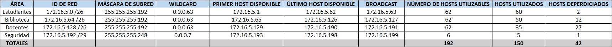

# MANUAL TÉCNICO - PROYECTO 2
#### Laboratorio de Redes de Computadoras 1 - Sección A
---------

## Tabla de direcciones IP y VLAN

En la siguiente tabla se presentan los distintos equipos, especificando su ID, IP que utilizan, máscara de subred, VLAN a la que tienen acceso y el área en el cual se ubican.

| ÁREA      | VLAN | EQUIPO | IP   | MÁSCARA DE SUBRED     |
| :-------: | :--: | :----: | :--: | :-------------------: |
| CUNDECH | 32 | Seguridad2 | 192.168.5.226 | 255.255.255.248 |
| CUNDECH | 42 | Biblioteca3 | 192.168.5.2 | 255.255.255.128 |
| CUNDECH | 42 | Biblioteca4 | 192.168.5.3 | 255.255.255.128 |
| CUNDECH | 12 | Estudiantes6 | 192.168.5.130 | 255.255.255.192 |
| CUNDECH | 12 | Estudiantes7 | 192.168.5.131 | 255.255.255.192 |
| CUNDECH | 22 | Docentes7 | 192.168.5.195 | 255.255.255.224 |
| CUNDECH | 22 | Docentes6 | 192.168.5.194 | 255.255.255.224 |
| CUNOROC | 12 | Estudiantes3 | 192.148.5.130 | 255.255.255.192 |
| CUNOROC | 22 | Docentes3 | 192.148.5.194 | 255.255.255.224 |
| CUNOROC | 32 | Seguridad3 | 192.148.5.226 | 255.255.255.240 |
| CUNOROC | 42 | Biblioteca1 | 192.148.5.2 | 255.255.255.128 |
| CUNOC | 12 | Estudiantes1 | 172.16.5.4 | 255.255.255.192 |
| CUNOC | 12 | Estudiantes2 | 172.16.5.5 | 255.255.255.192 |
| CUNOC | 22 | Docentes1 | 172.16.5.132 | 255.255.255.192 |
| CUNOC | 22 | Docentes2 | 172.16.5.133 | 255.255.255.192 |
| CUNOC | 32 | Seguridad4 | 172.16.5.196 | 255.255.255.248 |
| CENTRAL | Server0 | Server0 | 192.120.5.2 | 255.255.255.0 |
| CENTRAL | Server1 | Server1 | 192.121.5.2 | 255.255.255.0 |
| CENTRAL | Server2 | Server2 | 192.122.5.2 | 255.255.255.0 |
| CUM | 12 | Estudiantes5 | 192.158.5.132 | 255.255.255.192 |
| CUM | 22 | Docentes5 | 192.158.5.196 | 255.255.255.224 |
| CUM | 32 | Seguridad1 | 192.158.5.228 | 255.255.255.240 |
| CUM | 42 | Biblioteca2 | 192.158.5.4 | 255.255.255.128 |


## IMPLEMENTACIÓN TOPOLOGÍA

En la siguiente imagen se presenta la topología de red implementada:


## TABLA VLSM

##### CUNDECH
###### ID DE RED: 192.168.5.0 /24

Ordenar por cantidad de hosts e identificar las máscaras de subred:

| ÁREA | CANT. HOSTS | CIDR | MÁSCARA DE SUBRED |
| :---------: | :---: | :--: | :-------------: |
| Biblioteca  | 100   | /25  | 255.255.255.128 |
| Estudiantes | 50    | /26  | 255.255.255.192 |
| Docentes    | 20    | /27  | 255.255.255.224 |
| Seguridad   | 5     | /29  | 255.255.255.248 |

Asignar las direcciones de red:


Solución:

| ÁREA | CIDR | CANT. HOSTS | HOSTS UTILIZABLES | ID DE RED |
| :---------: | :--: | :--: | :--: | :---------------: |
| Biblioteca  | /25  | 128  | 126  | 192.168.5.0 /25   |
| Estudiantes | /26  | 64   | 62   | 192.168.5.128 /26 |
| Docentes    | /27  | 32   | 30   | 192.168.5.192 /27 |
| Seguridad   | /29  | 8    | 6    | 192.168.5.224 /29 |

##### CUNOROC
###### ID DE RED: 192.148.5.0 /24

Ordenar por cantidad de hosts e identificar las máscaras de subred:

| ÁREA | CANT. HOSTS | CIDR | MÁSCARA DE SUBRED |
| :---------: | :--: | :--: | :-------------: |
| Biblioteca  | 75   | /25  | 255.255.255.128 |
| Estudiantes | 45   | /26  | 255.255.255.192 |
| Docentes    | 25   | /27  | 255.255.255.224 |
| Seguridad   | 10   | /28  | 255.255.255.240 |

Asignar las direcciones de red:


Solución:

| ÁREA | CIDR | CANT. HOSTS | HOSTS UTILIZABLES | ID DE RED |
| :---------: | :--: | :--: | :--: | :---------------: |
| Biblioteca  | /25  | 128  | 126  | 192.168.5.0 /25   |
| Estudiantes | /26  | 64   | 62   | 192.168.5.128 /26 |
| Docentes    | /27  | 32   | 30   | 192.168.5.192 /27 |
| Seguridad   | /28  | 16   | 14   | 192.168.5.224 /28 |

##### CUNOC
###### ID DE RED: 172.16.5.0 /24

Ordenar por cantidad de hosts e identificar las máscaras de subred:

| ÁREA | CANT. HOSTS | CIDR | MÁSCARA DE SUBRED |
| :---------: | :--: | :--: | :-------------: |
| Estudiantes | 60   | /26  | 255.255.255.192 |
| Biblioteca  | 50   | /26  | 255.255.255.192 |
| Docentes    | 35   | /26  | 255.255.255.192 |
| Seguridad   | 5    | /29  | 255.255.255.248 |

Asignar las direcciones de red:


Solución:

| ÁREA | CIDR | CANT. HOSTS | HOSTS UTILIZABLES | ID DE RED |
| :---------: | :--: | :--: | :--: | :---------------: |
| Estudiantes | /26  | 64   | 62   | 192.168.5.0 /26   |
| Biblioteca  | /26  | 64   | 62   | 192.168.5.64 /26  |
| Docentes    | /26  | 64   | 62   | 192.168.5.128 /26 |
| Seguridad   | /29  | 8    | 6    | 192.168.5.192 /29 |

##### CUM
###### ID DE RED: 192.158.5.0 /24

Ordenar por cantidad de hosts e identificar las máscaras de subred:

| ÁREA | CANT. HOSTS | CIDR | MÁSCARA DE SUBRED |
| :---------: | :--: | :--: | :-------------: |
| Biblioteca  | 75   | /25  | 255.255.255.128 |
| Estudiantes | 45   | /26  | 255.255.255.192 |
| Docentes    | 25   | /27  | 255.255.255.224 |
| Seguridad   | 10   | /28  | 255.255.255.240 |

Asignar las direcciones de red:


Solución:

| ÁREA | CIDR | CANT. HOSTS | HOSTS UTILIZABLES | ID DE RED |
| :---------: | :--: | :--: | :--: | :---------------: |
| Biblioteca  | /25  | 128  | 126  | 192.158.5.0 /25   |
| Estudiantes | /26  | 64   | 62   | 192.158.5.128 /26 |
| Docentes    | /27  | 32   | 30   | 192.158.5.192 /27 |
| Seguridad   | /28  | 16   | 14   | 192.158.5.224 /28 |


## COMANDOS UTILIZADOS

Para la configuración de los dispositivos de la topología, se utilizaron los siguientes comandos:

##### CONFIGURACIÓN DE HOSTNAME
```
enable
configure terminal
hostname [nombre_host]
do w
exit
exit
```

##### CONFIGURACIÓN VTP Y VLANs
###### SWITCH SERVIDOR
```
enable
configure terminal
vtp mode server
vtp domain Grupo5
vtp password usac2025
vtp version 2
vlan [número_vlan]
name [nombre_vlan]
exit
...
# Configuración de otras vlan
...
// Configuración de puerto en modo trunk
interface FastEthernet0/X //Donde X es el número de interfaz
// Si es multicapa, agregar: switchport trunk encapsulation dot1q
switchport mode trunk
exit
...
# Configuración de otros puertos en modo trunk
...
[# PARA ALGUNOS SWITCHES #
// Configuración de puerto en modo acceso
interface FastEthernet0/X //Donde X es el número de interfaz
switchport mode access
switchport access vlan XX //Donde XX es el número de vlan a la que se dá acceso
exit
...
# Configuración de otros puertos en modo acceso
...
]
do w
exit
exit
```

###### SWITCHES CLIENTES
```
enable
configure terminal
vtp mode client
vtp domain Grupo5
vtp password usac2025
vtp version 2
// Configuración de puerto en modo trunk
interface FastEthernet0/X //Donde X es el número de interfaz
// Si es multicapa, agregar: switchport trunk encapsulation dot1q
switchport mode trunk
exit
...
# Configuración de otros puertos en modo trunk
...
[# PARA ALGUNOS SWITCHES #
// Configuración de puerto en modo acceso
interface FastEthernet0/X //Donde X es el número de interfaz
switchport mode access
switchport access vlan XX //Donde XX es el número de vlan a la que se dá acceso
exit
...
# Configuración de otros puertos en modo acceso
...
]
do w
exit
exit
```

##### CONFIGURACIÓN SWITCHES VLANs SIN VTP
```
enable
configure terminal
vlan [número_vlan]
name [nombre_vlan]
exit
...
# Configuración de otras vlan
...
// Configuración de puerto en modo trunk
interface FastEthernet0/X //Donde X es el número de interfaz
// Si es multicapa, agregar: switchport trunk encapsulation dot1q
switchport mode trunk
exit
...
# Configuración de otros puertos en modo trunk
...
[# PARA ALGUNOS SWITCHES #
// Configuración de puerto en modo acceso
interface FastEthernet0/X //Donde X es el número de interfaz
switchport mode access
switchport access vlan XX //Donde XX es el número de vlan a la que se dá acceso
exit
...
# Configuración de otros puertos en modo acceso
...
]
do w
exit
exit
```

##### CONFIGURACIÓN ETHERCHANNEL (LACP)
###### SWITCHES (active-active)
```
enable
configure terminal
interface range FastEthernet 0/X-Y //X puerto inicio, Y puerto fin
switchport trunk encapsulation dot1q
switchport mode trunk
switchport trunk allowed vlan all
channel-protocol lacp
channel-group [número] mode active
do w
exit
interface port-channel [número]
switchport trunk encapsulation dot1q
switchport mode trunk
switchport trunk allowed vlan all
do w
exit
exit
exit
```

##### CONFIGURACIÓN RUTEO INTERVLAN CON INTERFACES VIRTUALES (SVI)
###### CUNDECH

VLANs utilizadas:

| VLAN | NOMBRE | RANGO DE IP | MÁSCARA DE SUBRED |
| :--: | :---------: | :---------------: | :-------------: |
| 12   | Estudiantes | 192.168.5.128 /26 | 255.255.255.192 |
| 22   | Docentes    | 192.168.5.192 /27 | 255.255.255.224 |
| 32   | Seguridad   | 192.168.5.224 /29 | 255.255.255.248 |
| 42   | Biblioteca  | 192.168.5.0 /25   | 255.255.255.128 |

###### CUNOC

VLANs utilizadas:

| VLAN | NOMBRE | RANGO DE IP | MÁSCARA DE SUBRED |
| :--: | :---------: | :--------------: | :-------------: |
| 12   | Estudiantes | 172.16.5.0 /26   | 255.255.255.192 |
| 22   | Docentes    | 172.16.5.128 /26 | 255.255.255.192 |
| 32   | Seguridad   | 172.16.5.192 /29 | 255.255.255.248 |
| 42   | Biblioteca  | 172.16.5.64 /26  | 255.255.255.192 |

```
enable
configure terminal
interface vlan [número]
ip address [IP_default_gateway] [máscara_de_subred]
no shutdown
exit
...
# Configuración de otras vlans
...
ip routing
do w
exit
exit
```

##### CONFIGURACIÓN RUTEO INTERVLAN ROUTER-ON-A-STICK CON VTP
###### CUNOROC

VLANs utilizadas:

| VLAN | NOMBRE | RANGO DE IP | MÁSCARA DE SUBRED |
| :--: | :---------: | :---------------: | :-------------: |
| 12   | Estudiantes | 192.148.5.128 /26 | 255.255.255.192 |
| 22   | Docentes    | 192.148.5.192 /27 | 255.255.255.224 |
| 32   | Seguridad   | 192.148.5.224 /28 | 255.255.255.240 |
| 42   | Biblioteca  | 192.148.5.0 /25   | 255.255.255.128 |

###### CENTRAL

VLANs utilizadas:

| VLAN | NOMBRE | RANGO DE IP | MÁSCARA DE SUBRED |
| :--: | :-----: | :-------------: | :-----------: |
| 52   | Server0 | 192.120.5.0 /24 | 255.255.255.0 |
| 62   | Server1 | 192.121.5.0 /24 | 255.255.255.0 |
| 72   | Server2 | 192.122.5.0 /24 | 255.255.255.0 |

###### CUM

VLANs utilizadas:

| VLAN | NOMBRE | RANGO DE IP | MÁSCARA DE SUBRED |
| :--: | :---------: | :---------------: | :-------------: |
| 12   | Estudiantes | 192.158.5.128 /26 | 255.255.255.192 |
| 22   | Docentes    | 192.158.5.192 /27 | 255.255.255.224 |
| 32   | Seguridad   | 192.158.5.224 /28 | 255.255.255.240 |
| 42   | Biblioteca  | 192.158.5.0 /25   | 255.255.255.128 |

```
enable
configure terminal
interface GigabitEthernet 0/X //Donde X es el número de interfaz
no shutdown
exit
interface GigabitEthernet0/X.Y //Donde X es el número de interfaz y Y el valor de la vlan a configurar
encapsulation dot1q [número_vlan]
ip address [IP_default_gateway] [máscara_de_subred]
exit
...
# Configuración de otras vlans
...
do w
exit
exit
```

##### CONFIGURACIÓN ENLACES
###### BACKBONE

```
enable
configure terminal
interface [tipo] [X] //Donde X es el número de interfaz
//Tipo puede ser FastEthernet, GigabitEthernet, Serial, (en caso de etherchannel usar: port-channel [número])
//En los switches capa 3: no switchport
ip address [IP] [máscara_de_subred]
no shutdown
exit
...
# Configuración de otros enlaces
...
do w
exit
exit
```

##### CONFIGURACIÓN RIP

```
enable
configure terminal
//Si es switch: ip routing
router rip
version 2
network [id_red]
...
# Configuración otras networks
...
no auto-summary
do w
exit
exit
```

##### CONFIGURACIÓN OSPF

```
enable
configure terminal
//Si es switch: ip routing
router ospf 5
network [id_red] [wildcard] area 0
...
# Configuración otras networks
...
do w
exit
exit
```

##### CONFIGURACIÓN EIGRP

```
enable
configure terminal
//Si es switch: ip routing
router eigrp 5
network [id_red] [wildcard]
...
# Configuración otras networks
...
no auto-summary
do w
exit
exit
```

##### REDISTRIBUCIÓN DE RUTAS
###### RIP - OSPF
```
router ospf 5
redistribute rip subnets
do w

router rip
redistribute ospf 5 metric 1
do w
```

###### OSPF - EIGRP
```
router ospf 5
redistribute eigrp 5 subnets
do w

router eigrp 5
redistribute ospf 5 metric 10000 100 255 1 1500
do w
```

##### CONFIGURACIÓN HSRP (HOT STANDBY ROUTER PROTOCOL)
###### ALTA PRIORIDAD
```
interface [interfaz] //vlan [número_vlan] para switch, GigabitEthernet0/X.[número_vlan] para router
standby [número_vlan] ip [IP]
standby [número_vlan] priority 150
standby [número_vlan] preempt
no shutdown
...
# Otras configuraciones
...
do w
exit
exit
```

###### BAJA PRIORIDAD
```
interface [interfaz] //vlan [número_vlan] para switch, GigabitEthernet0/X.[número_vlan] para router
standby [número_vlan] ip [IP]
standby [número_vlan] priority 100
standby [número_vlan] preempt
no shutdown
...
# Otras configuraciones
...
do w
exit
exit
```

##### COMANDOS DE VERIFICACIÓN
###### VLAN
```
show vlan brief
```

###### ESTADO VTP
```
show vtp status
```

###### PUERTOS EN MODO TRUNK
```
show interfaces trunk
```

###### ETHERCHANNEL
```
show etherchannel summary
show interfaces port-channel 1
show spanning-tree active
```

###### RUTEO DINÁMICO
```
show ip route
show ip route ospf
show ip route rip
show ip route eigrp
show ip protocols
show ip interface brief
```

###### HSRP
```
show standby
```